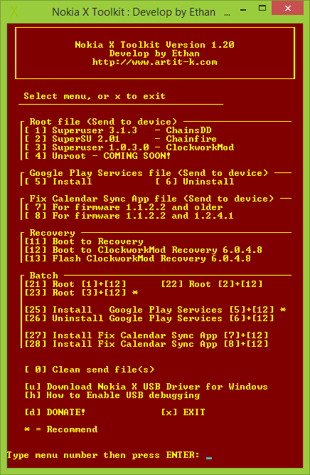

# Nokia X Toolkit

[](http://www.artit-k.com/nokia-x-platform/tool/nokia-x-toolkit/donate.php)

[**Download**](PACKAGE)

#### Screenshot


#### Video
[](http://www.youtube.com/watch?v=EnuwWX_l5y4)

#### News & Review
* [Root หรือลง Play Store ง่ายๆ บน Nokia X กับ Nokia X Toolkit](http://droidsans.com/node/160130) @ DroidSans.com
* [การติดตั้ง Google Service บน Nokia X โดยไม่ต้อง Root เครื่อง ใช้ได้กับเฟิร์มแวร์ล่าสุด](http://www.appdisqus.com/2014/04/12/how-to-install-google-service-in-nokia-x-without-root-required.html) @ AppDisqus.com
* [ติดตั้ง Google Play Services บน Nokia X โดยไม่ต้อง Root เครื่อง !!!](http://www.whatphone.tv/review/application/nokia-x-google-play-services/) @WhatPhone.tv
* [How to Root Nokia X, Nokia XL after v1.1.2.2 update](http://maktechblog.com/how-to-root-nokia-x-nokia-xl-after-v1-1-2-2-update/) @ MakTechBlog.com
* [How to Root Nokia X, Nokia XL on v1.1.2.2 Update](http://www.freewaresquad.com/2014/06/09/root-nokia-x-nokia-xl-v1-1-2-2-update/) @ FreewareSQUAD.com
* [How to root Nokia X using one-click-root program](http://playfuldroid.com/how-to-root-nokia-x-using-one-click-root-program/) @ Playfuldroid.com
* [Turn your Nokia X into a real Android (video)](http://pocketnow.com/2014/05/07/root-the-nokia-x) @ Pocketnow.com
* [Nokia X Rooting Basics](http://www.viceaster.com/2014/04/14/nokia-x-root/) @ viceaster.com

#### Special Thank (Tester)
* **v0.90**
  + [Ake Exorcist](https://www.facebook.com/Akexorcist)

#### Change Log

* **v1.20** : 2014-07-31
  + Update Install Google Play Services
  + Update Uninstall Google Play Services
  + Update Chainfire’s SuperSU version
  + Add Install Fix Calendar Sync app
* **v1.10** : 2014-05-28
  + Update Install Google Play Services
  + Update Uninstall Google Play Services
  + Update ClockworkMod Recovery version
* **v1.00** : 2014-04-10
  + Add Root by ChainsDD’s Superuser
  + Add Root by Chainfire’s SuperSU
  + Add Root by ClockworkMod’s Superuser
  + Add Uninstall Google Play Services
  + Add Boot to Recovery
  + Add Flash ClockworkMod Recovery
  + Redesign menu
* **v0.90** : 2014-04-09
  + Launch

#### License
```
Copyright 2014 Artit Kiuwilai

Licensed under the Apache License, Version 2.0 (the "License");
you may not use this file except in compliance with the License.
You may obtain a copy of the License at

  http://www.apache.org/licenses/LICENSE-2.0

Unless required by applicable law or agreed to in writing, software
distributed under the License is distributed on an "AS IS" BASIS,
WITHOUT WARRANTIES OR CONDITIONS OF ANY KIND, either express or implied.
See the License for the specific language governing permissions and
limitations under the License.
```
